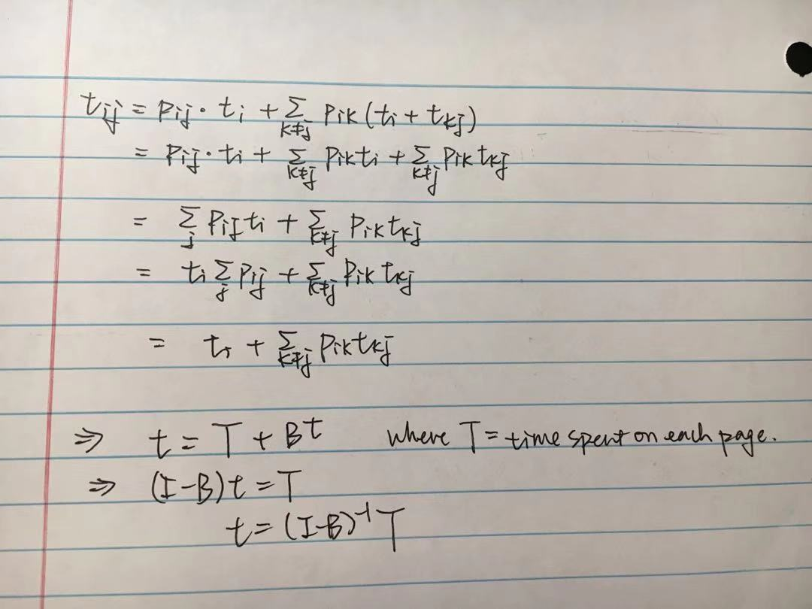

```{r setup, include=FALSE}
knitr::opts_chunk$set(echo = TRUE)
```

##Problem 1

In Markov100.txt, the one step transition probability matrix for a Markov chain with 100 states (State 1 to
State 100) is given. Note that the data has no heading.
Name of the data set Markov100
Number of rows 100
Number of columns 100

```{r}
markov <- read.table("markov100.txt", header=FALSE)
P <- as.matrix(markov);
```

## problem 1(a)

Suppose we are at State 1 now. Find and display the probability of being in State 5 after 10 transitions.

```{r}
zero <- matrix(0, 1, 99)
one <- matrix(1,1,1)
a <- as.matrix(cbind(one, zero))
library(expm)
prob10 <- a %*% (P %^% 10)
prob10[1,5]
print(paste("the probability of being in State 5 after 10 transitions is ", prob10[1,5]))
```

The probability of being in State 5 after 10 transitions is  0.0450909981609373"

-------------------------------------------------------------------------------------------

## problem 1(b)

Suppose we are at one of States 1,2, and 3 with equal probabilities. Find and display the probability of being in State 10 after 10 transitions.
```{r}
first_three <- matrix(1/3, 1, 3)
zeros <- matrix(0, 1, 97)
init <- as.matrix((cbind(first_three, zeros)))
prob10_b <- init %*% (P %^% 10)
prob10_b[1,10]
print(paste("the probability of being in State 10 after 10 transitions is ", prob10_b[1,10]))
```

The probability of being in State 10 after 10 transitions is  0.0826890133603156

-------------------------------------------------------------------------------------------

## problem 1(c)

Find the steady state probability of being in State 1.

```{r}
Q <- t(P) - diag(100)
Q[100,] <- matrix(1,1,100)
zero_c <- matrix(0,1,99)
one_c <- matrix(1,1,1)
rhs <- as.matrix(cbind(zero_c, one_c))
Pi <- solve(Q) %*% t(rhs)
Pi[1,]
print(paste("the steady state probability of being in State 1 is ", Pi[1,]))
```

The steady state probability of being in State 1 is  0.0125658937530593

-------------------------------------------------------------------------------------------

## problem 1(d)

Find the mean first passage time from State 1 to State 100.

```{r}
B <- P[1:99,1:99]
Q <- diag(99) - B
e <- matrix(1,1,99)
m <- solve(Q) %*% t(e)
m[1,]
print(paste("the mean first passage time from State 1 to State 100 is ", m[1,]))
```

The mean first passage time from State 1 to State 100 is  254.939463100014

-------------------------------------------------------------------------------------------

## Problem 2

```{r}
web <- read.table("webtraffic.txt", header=TRUE)
```

## problem 2(a)

Construct 9 by 9 matrix Traffic that counts total traffic between State i to State j for all i = 1,...,9 and j = 1,...,9. Display Traffic.
Hint colSums() adds all rows for each column.

```{r}
colsums <- colSums(web)
Traffic <- matrix(colsums, nrow = 9, ncol = 9, byrow = TRUE)
Traffic
```

## problem 2(b)

Observe that Traffic has 0’s in row 9 and 0’s in column 1. Set Traffic[9,1]=1000. Construct the one step transition probability matrix P and display it.

```{r}
Traffic[9,1] = 1000
P_2 <- Traffic/rowSums(Traffic)
P_2
```

## problem 2(c)

Calculate and display the steady state probability vector Pi.

```{r}
Q_2 <- t(P_2) - diag(9)
Q_2[9,] <- matrix(1,1,9)
zero_q2 <- matrix(0,1,8)
one_q2 <- matrix(1,1,1)
rhs_q2 <- as.matrix(cbind(zero_q2, one_q2))
invQ_2 <- solve(Q_2)
Pi_2 <- solve(Q_2) %*% t(rhs_q2)
Pi_2
```

## problem 2(d)

The following table presents the average time that the visitors spend on each page.
Page         1  2 3 4 5 6 7 8
Avg(minute) 0.1 2 3 5 5 3 3 2
Calculate and display the average time a visitor spend on the website (until she leaves).

```{r}
T <- c(0.1, 2, 3, 5, 5, 3, 3, 2)
T <- as.matrix(T)
B2 <- P_2[1:8,1:8]
Q2 <- diag(8) - B2
m2 <- solve(Q2) %*% T
m2[1,]
print(paste("the average time(minutes) a visitor spend on the website until she leaves is ", m2[1,]))
```

The average time a visitor spend on the website until she leaves is 14.563

## problem 2(e)

In the output of Problem 2(c), observe that Pages 3 and 4 are one of the most crowded pages except Pages 1 and 9. To balance the traffic, the owner of the website decided to create links from Page 2 to Pages 6,7 (hence, from State 2 to States 6,7). By adding the links, the owner anticipates that, from Page 2, 30% of the current outgoing traffic to State 3 would move to State 6, and 20% of the current outgoing traffic to State 4 would move to State 7. Calculate new steady state probability vector Pi2 to check the effect of the new links. Decide if the link helped balancing the traffic by comparing the variance of Pi and Pi2.
Hint Start with matrix Traffic from Problem 2(a).

```{r pressure, echo=FALSE, fig.cap="2e)", out.width = '100%'}

```

```{r}
Traffic_e <- as.matrix(Traffic)
t_23 <- Traffic_e[2,3]
t_26 <- t_23 * 0.3 
t_23new <- t_23 * (1-0.3)
t_24 <- Traffic_e[2,4]
t_27 <- t_24 * 0.2 
t_24new <- t_24 * (1-0.2)
Traffic_e[2,3] <- t_23new
Traffic_e[2,4] <- t_24new
Traffic_e[2,6] <- t_26
Traffic_e[2,7] <- t_27
P2 <- Traffic_e/rowSums(Traffic_e)
Q2 <- t(P2) - diag(9)
Q2[9,] <- matrix(1,1,9)
zeroq2 <- matrix(0,1,8)
oneq2 <- matrix(1,1,1)
rhsq2 <- as.matrix(cbind(zeroq2, oneq2))
invQ2 <- solve(Q2)
Pi2 <- solve(Q2) %*% t(rhsq2)
Pi2
var(Pi_2)
print(paste("the variance of Pi before balancing is ", var(Pi_2)))
var(Pi2)
print(paste("the variance of Pi after balancing is ", var(Pi2)))
```

In the output of Problem 2(c), we observed that Pages 3 and 4 are one of the most crowded pages except Pages 1 and 9. The steady state probability of state 3 is 0.13077897 and of state 4 is 0.14012033. After adding the new link, we can see that both of state 3's and state 4's steady state probability dropped (0.12104331 and 0.12275720 resepectively). Also, the steady state probabilities of State 6 and State 7 increased after adding the link. Although, the magnitude of the decrease is not very large, but adding this link from State 2 to States 6,7 still have the correct effect that we anticipated. 

Also, to get a better understanding on the balancing effect, we calculated the variances of Pi1 and Pi2. Result: before balancing, var(Pi) =  0.001410675 and after adding the new link, var(Pi2) = 0.001219604. Obviously, there is a drop in the variance, which implied that the link helped balancing the traffic.

